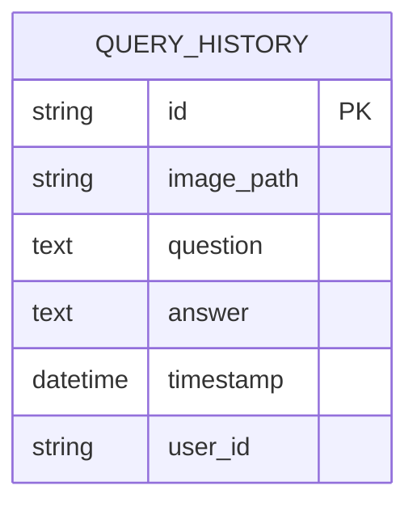

yarn dev

# Smart Visual Q&A System

>A Visual Language Model (VLM) powered Question Answering system with Gemma-3.

---

## Features

- Upload an image and ask a question about it, or just ask a question (image optional)
- Receives answers from a multimodal AI backend (Gemma-3)
- Query history stored in SQLite
- Modern, user-friendly UI (dark style, responsive)

---

## Database Schema



---

## Project Structure

- **frontend/**: Next.js 14 app (React, Tailwind CSS, next-themes)
- **backend/**: FastAPI app with HuggingFace Gemma-3 model, SQLite, and image handling

---

## Getting Started

### 1. Backend Setup

1. Install Python dependencies:
    ```bash
    pip install -r requirements.txt
    ```
2. Create a `.env` file in `backend/` with your HuggingFace token:
    ```env
    HUGGINGFACE_TOKEN=your_token_here
    ```
3. Start the backend:
    ```bash
    uvicorn main:app --host 0.0.0.0 --port 8000 --reload
    ```

### 2. Frontend Setup

1. Install Node dependencies:
    ```bash
    npm install
    ```
2. Start the frontend:
    ```bash
    npm run dev
    ```
3. Open [http://localhost:3000](http://localhost:3000) in your browser.

---

## Usage

1. Upload an image (optional), enter your user ID and question, and submit.
2. The answer will appear in the Answer panel, rendered as Markdown for readability.

---

## Tech Stack

- **Frontend:** Next.js, React, Tailwind CSS, next-themes, react-markdown
- **Backend:** FastAPI, HuggingFace Transformers, SQLite, SQLAlchemy

---

## Example Query Flow

1. User uploads an image (optional) and enters a question.
2. The frontend sends the data to the backend `/vqa` endpoint.
3. The backend processes the image/question, generates an answer, and stores the query in the database.
4. The answer is returned and displayed in the Answer panel.

---

## License

MIT License. See [LICENSE](./LICENSE) for details.